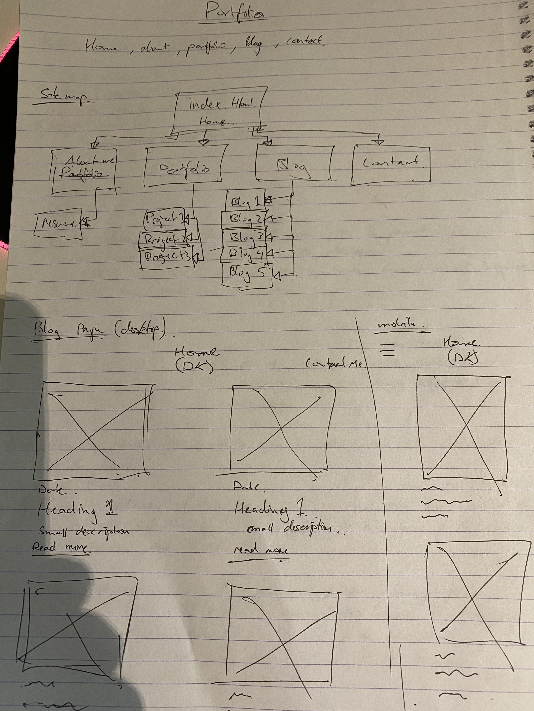

# T1A3 - Portfolio 

### Links

Portfolio Webpage

[GitHub](https://github.com/d1koder/PORTFOLIO)

## 1.0	Purpose

The purpose for this assignment is to develop a website with correct use of HTML and XHTML. It should follow a detailed design brief. 

This will be acheived by designing and creating a website, which will basically be a portfolio of me (Daniel Kim). The portfolio will be targeted towards prospective employers, and contain information about my skills, interests, proffesional knowledge, and a showcase of past and current work. 

## 2.0	Functionality/Features

As for the UX/UI, the portfolio website will take a minimalist approach, so as to direct the users focus less on "the novelties" and more on why they're here (my portfolio website). Website will incorporate SRI and responisve design in order to work on mobile and tablet devices. 

Lots of white space will be selectivley used to acheive this desired amount of minimalism, with the addition of high resolution images strategically placed in the background's and cover photo areas. In addition, a navigation bar feature will be included with the headings:

- About Me
- Portfolio
- Blog
- Contact 

Other features will include a search bar, in case the user would like to search for anything specific, and a contact box where users can submit their inquiries. Links to relevent socials will also be included within the footer. 

## 3.0 	Sitemap

Below is sitemap first conducted by a hand sketch, with the final changes shown afterwards. The only change being, an extra link would be included in the 'Contact' page to direct user/s to resume PDF.

## 4.0	Screenshots

## 5.0 	Target audience

The target audience for this portfolio website will be prospective employers (for me, tech start-ups) searching to engage a dev of any kind (front end, back end, or full stack) and/or an IT proffesional. The audience can also be expanded towards small to medium sized business owners that are looking to create or improve their digital standpoint. 

Employers will generally be expected to possess certain technical knowledge relating to Information Technology such as, software development, coding, programming languages and development stacks. Along with outstanding professionalism, collaboration and positive work ethic.

## 6.0	Tech Stack

- HTML5

- XHTML

- CSS3

  